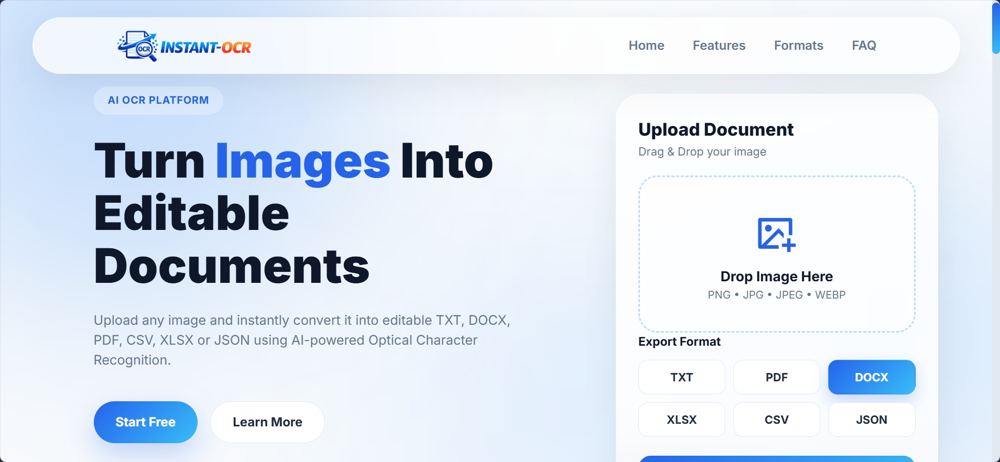

# ⚡ InstantOCR

**Transform Images & Documents into Editable Files in Seconds.**

_InstantOCR is a powerful web-based application designed to extract text from images and PDF documents seamlessly, exporting them into multiple editable formats._

---

### 🎨 Product Preview

 

## ✨ Key Features

- **🚀 Drag & Drop Interface:** Modern, intuitive, and responsive UI built with GSAP animations.
- **📄 Multi-Format Export:** Extract and convert text into **TXT, PDF, DOCX, XLSX, CSV,** and **JSON**.
- **🖼️ Real-time Image Preview:** Interactive preview area with memory-managed Blob generation and quick file removal.
- **📊 Live Processing Progress:** Real-time feedback bar showing conversion progress.
- **📱 Fully Responsive:** Clean layout across Desktop, Tablet, and Mobile devices.
- **🛡️ Secure File Handling:** Client-side validation for file types and size limits with clean memory disposal.

---

## 🛠️ Tech Stack

- **Backend:** Python 3.10+, Django Framework, FastAPI
- **Frontend:** HTML5, CSS3 (Modern Glassmorphism & Flex/Grid), Vanilla JavaScript (ES6+)
- **Animation & FX:** GSAP (GreenSock), ScrollTrigger, Remix Icons
- **OCR Engine:** EasyOCR (Django Integration) & HuggingFace Model (**Premium**)

---

**`Note`** : Application is under development
